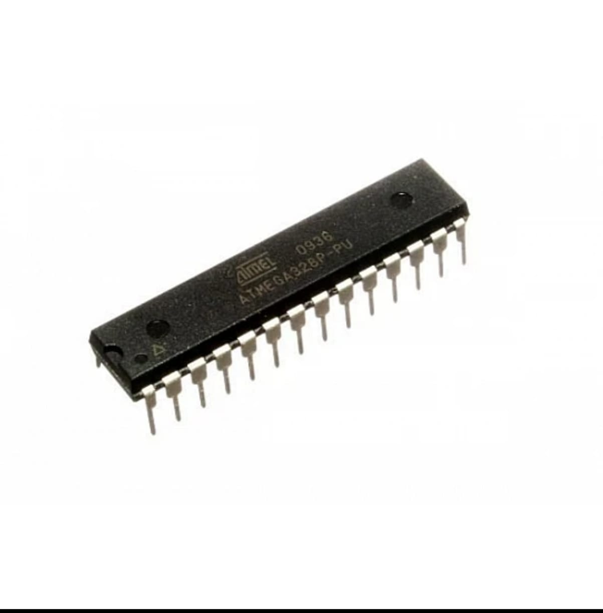
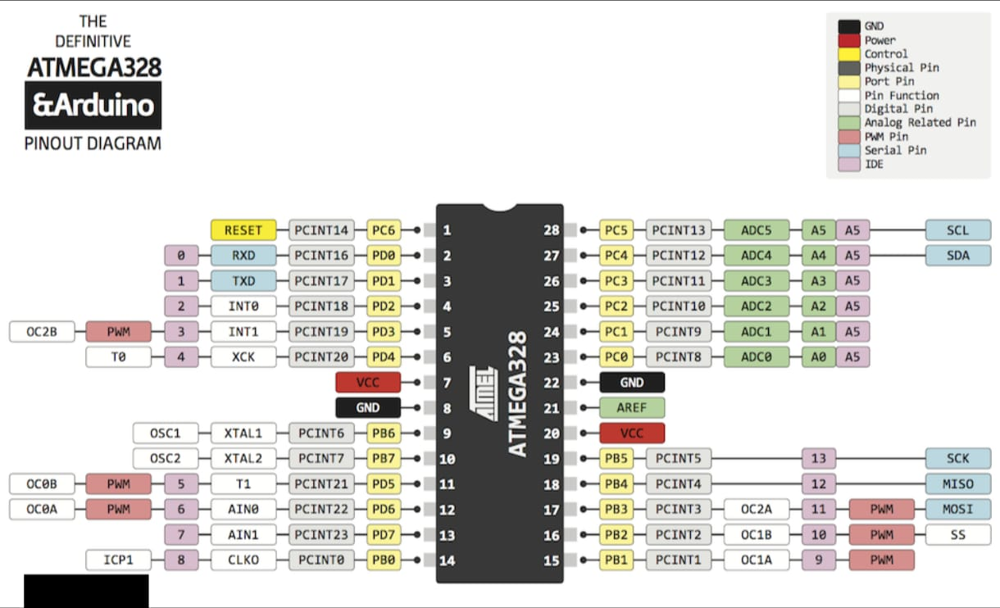

## Atmega328p 

---

## atmega328p pin layout

---

# ATmega328P

The ATmega328P is an 8-bit AVR microcontroller used in Arduino Uno.

## Key Features

- 32 KB Flash Memory
- 2 KB SRAM
- 1 KB EEPROM
- 16 MHz Clock
- ADC, PWM, SPI, I2C, USART
- Low Power Modes

Datasheet:
https://ww1.microchip.com/downloads/en/DeviceDoc/Atmel-7810-Automotive-Microcontrollers-ATmega328P_Datasheet.pdf