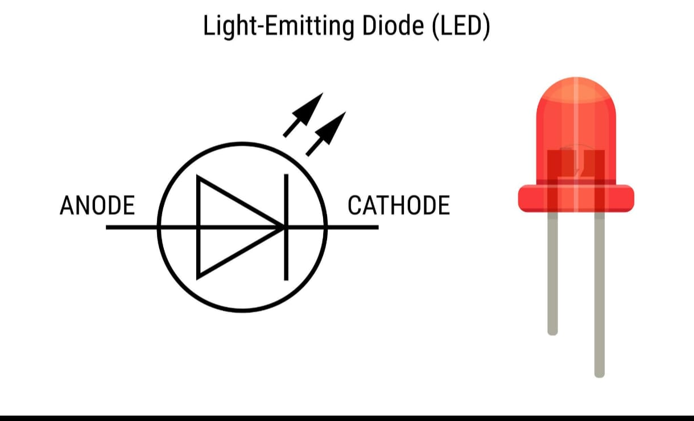

# LED and Push Button Control

This project demonstrates how to control LEDs and a buzzer using push buttons.

---
# LED Blinking 

## 1. Introduction

The built-in LED is an LED already connected to the Arduino board.  
In Arduino UNO, the built-in LED is connected to digital pin 13.

It is commonly used for testing programs and learning basic Arduino programming.  
Blinking the built-in LED is the first and simplest program in embedded systems.

---

## 2. Working

1. The LED is connected internally to digital pin 13.
2. When the pin is set to HIGH, the LED turns ON.
3. When the pin is set to LOW, the LED turns OFF.
4. By adding delay between HIGH and LOW states, the LED blinks continuously.

---

## 3. Arduino Code

```cpp
void setup() {
  pinMode(13, OUTPUT); // Set pin 13 as output
}

void loop() {
  digitalWrite(13, HIGH); // Turn LED ON
  delay(1000); // Wait for 1 second
  
  digitalWrite(13, LOW); // Turn LED OFF
  delay(1000); // Wait for 1 second
}
```
---



---

# LED, Push Button and Buzzer

---

## 1. Introduction

An LED (Light Emitting Diode) is used as a visual indicator.  
A push button is an input device that sends a signal to the Arduino when pressed.  
A buzzer is an output device that produces sound when activated.

By combining an LED, push button, and buzzer, we can create a simple alert or indication system.  
This setup is commonly used in alarm systems, calling bells, and basic embedded applications.

---

## 2. Working

1. The push button is connected to a digital input pin of the Arduino.
2. The LED and buzzer are connected to digital output pins.
3. When the push button is pressed, it sends a signal (HIGH or LOW) to the Arduino.
4. The Arduino reads the button state.
5. If the button is pressed:
   - The LED turns ON (visual indication).
   - The buzzer produces sound (audio indication).
6. When the button is released:
   - The LED turns OFF.
   - The buzzer stops.

---

## Complete Arduino Code

```cpp
int led1 = 12;
int led2 = 10;
int led3 = 8;

int sw1 = 6;
int sw2 = 5;
int sw3 = 2;

int buzzer = 4;

void setup() {
  pinMode(led1, OUTPUT);
  pinMode(led2, OUTPUT);
  pinMode(led3, OUTPUT);

  pinMode(sw1, INPUT);
  pinMode(sw2, INPUT);
  pinMode(sw3, INPUT);

  pinMode(buzzer, OUTPUT);
}

void loop() {
  int s1 = digitalRead(sw1);
  int s2 = digitalRead(sw2);
  int s3 = digitalRead(sw3);

  digitalWrite(led1, s1);
  digitalWrite(led2, s2);
  digitalWrite(led3, s3);

  if (s1 == HIGH || s2 == HIGH || s3 == HIGH)
    digitalWrite(buzzer, HIGH);
  else
    digitalWrite(buzzer, LOW);
}
```
---


