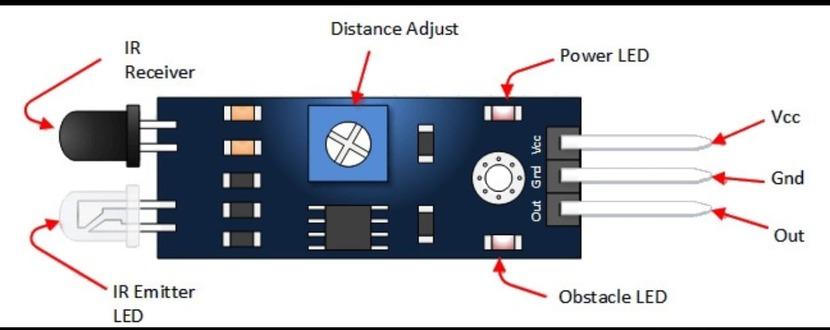
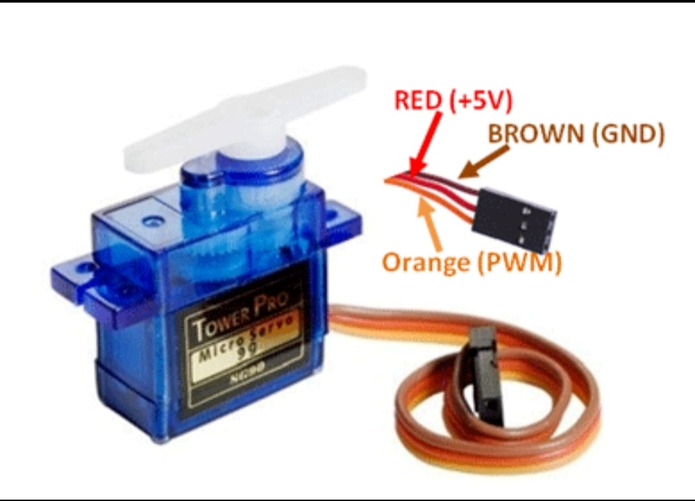
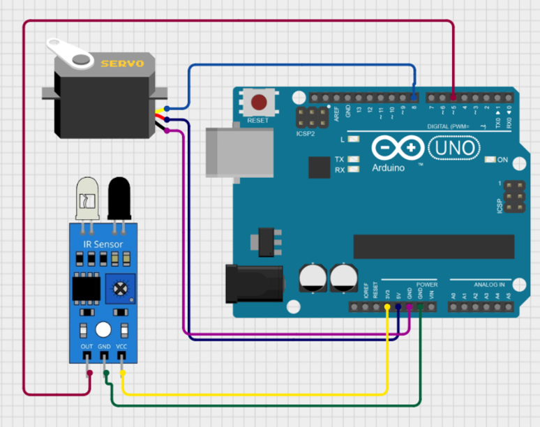

# IR Sensor and Servo Motor

This project detects an object using an IR sensor and controls a servo motor.

---

 ## 1. Introduction

An IR (Infrared) sensor is an electronic device used to detect objects and obstacles using infrared light.

It consists of:
- IR LED (Transmitter)
- Photodiode (Receiver)

The IR LED emits infrared light. When an object comes in front of the sensor, the light reflects back and is detected by the photodiode.

IR sensors are commonly used in:
- Obstacle detection
- Line follower robots
- Object counting systems
- Security systems

---

## 2. Working

1. The IR transmitter continuously emits infrared light.
2. When no object is present, the light does not reflect back.
3. When an object comes near, the IR light reflects back.
4. The receiver detects the reflected light.
5. The sensor output becomes LOW or HIGH depending on detection.
6. Arduino reads this signal and performs an action.

---

## 3. Arduino Code

```cpp
int irPin = 2; // IR sensor output connected to pin 2
int ledPin = 13; // Built-in LED

void setup() {
  pinMode(irPin, INPUT);
  pinMode(ledPin, OUTPUT);
  Serial.begin(9600);
}

void loop() {
  int sensorValue = digitalRead(irPin);

  if (sensorValue == LOW) { // Object detected
    digitalWrite(ledPin, HIGH);
    Serial.println("Object Detected");
  } 
  else {
    digitalWrite(ledPin, LOW);
    Serial.println("No Object");
  }

  delay(500);
}
```
---

 

---

 

---

# Servo Motor
---

## 1. Introduction

A servo motor is a rotary actuator used for precise control of angular position.  
It is commonly used in robotics, automation systems, and embedded projects.

A standard servo motor has three pins:
- VCC (5V)
- GND
- Signal (Control Pin)

Servo motors can rotate typically from 0° to 180°.

---

## 2. Working

1. The servo motor works using PWM (Pulse Width Modulation).
2. Arduino sends PWM signals to the signal pin.
3. The pulse width determines the angle of rotation.
4. The internal control circuit moves the shaft to the desired position.
5. The motor holds the position until a new signal is received.

Thus, the servo motor rotates to a specific angle based on the PWM signal from Arduino.

---

## 3. Arduino Code

```cpp
#include <Servo.h>

Servo myServo; // Create servo object

void setup() {
  myServo.attach(9); // Connect servo signal pin to Arduino pin 9
}

void loop() {
  myServo.write(0); // Move to 0 degrees
  delay(1000);

  myServo.write(90); // Move to 90 degrees
  delay(1000);

  myServo.write(180); // Move to 180 degrees
  delay(1000);
}
```



---
# IR Sensor and Servo Motor

---
## 1. Introduction

An IR (Infrared) sensor is an electronic device used to detect objects using infrared light.  
It consists of an IR LED (transmitter) and a photodiode (receiver). When an object comes near the sensor, the infrared light reflects back and is detected.

A servo motor is a rotary actuator used for precise control of angular position.  
It can rotate typically from 0° to 180° and is widely used in robotics, automation systems, and smart embedded projects.

By combining an IR sensor and a servo motor, automatic systems such as smart doors, automatic lids, and object-based movement systems can be developed.

---

## 2. Working

1. The IR sensor continuously emits infrared light.
2. When an object is detected, the reflected light is received.
3. The sensor sends a digital signal to the Arduino.
4. Arduino processes the signal.
5. Based on detection, Arduino sends a PWM signal to the servo motor.
6. The servo motor rotates to a specific angle.
7. When the object is removed, the servo returns to its original position.

Thus, the IR sensor detects the object, and the servo motor performs the required mechanical movement automatically.

---

## Complete Arduino Code

```cpp
#include <Servo.h>

Servo myServo;
int irPin = 2;

void setup() {
  pinMode(irPin, INPUT);
  myServo.attach(9);
}

void loop() {
  int irValue = digitalRead(irPin);

  if (irValue == LOW) {
    myServo.write(90);
  } else {
    myServo.write(0);
  }

  delay(200);
}
```


