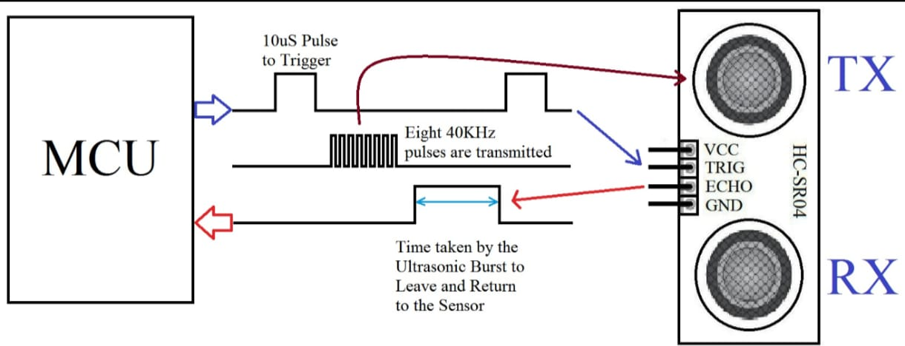
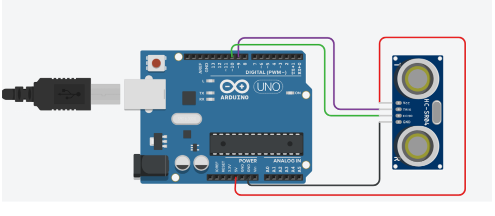

# Ultrasonic Distance Measurement

This project measures distance using an ultrasonic sensor.

---


---

## MECHANISM
 


---

## 1. Introduction

An ultrasonic sensor is a device used to measure distance using sound waves.  
In Arduino projects, the HC-SR04 ultrasonic sensor is commonly used for distance measurement and obstacle detection.

It works by sending ultrasonic sound waves and measuring the time taken for the echo to return.

Main Pins of HC-SR04:
- VCC
- GND
- Trigger (Trig)
- Echo

Ultrasonic sensors are widely used in:
- Obstacle detection systems
- Robot navigation
- Parking assist systems
- Distance measurement applications

---

## 2. Working

The ultrasonic sensor works based on the time-of-flight principle.

1. The Arduino sends a short pulse to the Trigger pin.
2. The sensor emits ultrasonic sound waves (around 40 kHz).
3. The sound waves travel through air and hit an object.
4. The waves reflect back to the sensor.
5. The Echo pin stays HIGH for the time taken by the sound to travel to the object and return.
6. Arduino calculates the distance using the formula:

   Distance = (Speed of Sound × Time) / 2

The division by 2 is used because the sound travels to the object and back.


---

## Complete Arduino Code

```cpp
int trigPin = 9;
int echoPin = 10;

long duration;
int distance;

void setup() {
  pinMode(trigPin, OUTPUT);
  pinMode(echoPin, INPUT);
  Serial.begin(9600);
}

void loop() {
  digitalWrite(trigPin, LOW);
  delayMicroseconds(2);

  digitalWrite(trigPin, HIGH);
  delayMicroseconds(10);
  digitalWrite(trigPin, LOW);

  duration = pulseIn(echoPin, HIGH);
  distance = duration * 0.034 / 2;

  Serial.print("Distance: ");
  Serial.println(distance);

  delay(500);
}
```

---


