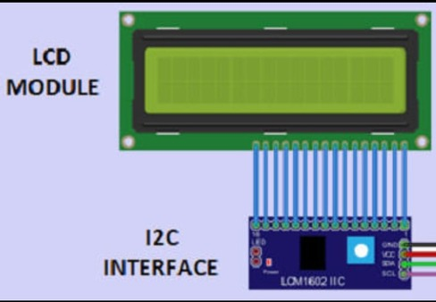
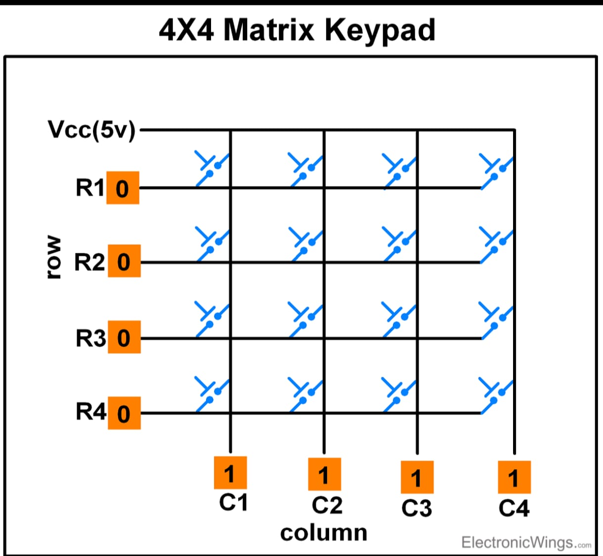
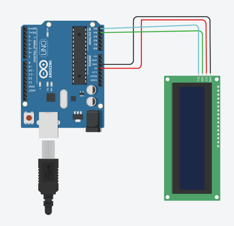

# LCD with I2C and 4x4 Keypad

This project displays keypad input on LCD screen using I2C communication.

---




---




---

## How It Works

- Keypad detects key press.
- Arduino reads key value.
- LCD displays pressed key.
- '#' confirms input.
- '*' clears input.

---

## Complete Arduino Code

```cpp
#include <Wire.h>
#include <LiquidCrystal_I2C.h>
#include <Keypad.h>

LiquidCrystal_I2C lcd(0x27, 16, 2);

const byte ROWS = 4;
const byte COLS = 4;

char keys[ROWS][COLS] = {
  {'1','2','3','A'},
  {'4','5','6','B'},
  {'7','8','9','C'},
  {'*','0','#','D'}
};

byte rowPins[ROWS] = {9, 8, 7, 6};
byte colPins[COLS] = {5, 4, 3, 2};

Keypad keypad = Keypad(makeKeymap(keys), rowPins, colPins, ROWS, COLS);

String input = "";

void setup() {
  lcd.init();
  lcd.backlight();
  lcd.setCursor(0,0);
  lcd.print("Enter Number:");
}

void loop() {
  char key = keypad.getKey();

  if (key) {

    if (key == '#') {
      lcd.clear();
      lcd.setCursor(0,0);
      lcd.print("You Entered:");
      lcd.setCursor(0,1);
      lcd.print(input);
      delay(2000);

      input = "";
      lcd.clear();
      lcd.print("Enter Number:");
    }

    else if (key == '*') {
      input = "";
      lcd.clear();
      lcd.print("Cleared");
      delay(1000);
      lcd.clear();
      lcd.print("Enter Number:");
    }

    else {
      input += key;
      lcd.setCursor(0,1);
      lcd.print(input);
    }
  }
}
```

## Connection


---



---


---
