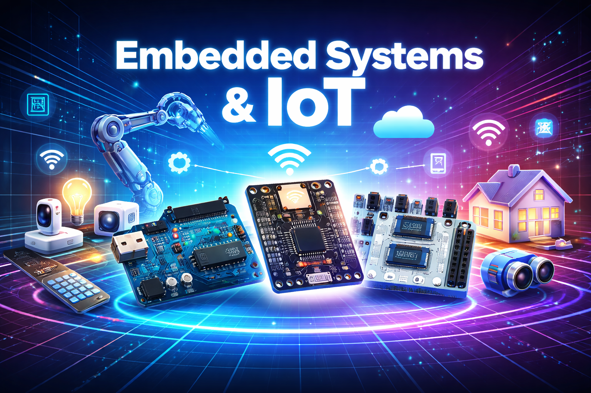

# Introduction to Embedded Systems and IoT Add-On Course

Welcome to the **Add-On Course on Embedded Systems and Internet of Things (IoT)**. This course is designed to provide students with practical knowledge and hands-on experience in designing and developing intelligent electronic systems using modern embedded platforms.

---

## What are Embedded Systems?

Embedded systems are specialized computing systems that perform dedicated functions within larger systems. They are widely used in:

- Home Automation Systems  
- Smart Vehicles  
- Healthcare Devices  
- Industrial Automation  
- Consumer Electronics  

With the advancement of IoT, embedded systems can now connect to the internet, enabling **remote monitoring, control, and data analysis**.

---

## Development Platforms Used in this Course

In this course, you will work with industry-relevant platforms:

- **Arduino** – Beginner-friendly microcontroller platform  
- **NodeMCU (ESP8266)** – WiFi-enabled IoT development board  
- **STM32 Nucleo Board** – Powerful ARM Cortex-M based microcontroller platform  

---

## What You Will Learn

This course will help you understand:

- Microcontrollers and Embedded Programming  
- Interfacing Sensors and Actuators  
- Digital and Analog Input/Output  
- Serial Communication Protocols (UART, I2C, SPI)  
- Wireless Communication and IoT Connectivity  
- Real-time Data Monitoring  

---

## Hands-On Learning

This course focuses on practical implementation. You will build projects such as:

- Sensor-based monitoring systems  
- IoT-enabled devices  
- Automation systems  

---

<!-- ## Course Outcomes

By the end of this course, you will be able to:

- Understand embedded system architecture  
- Write and debug embedded programs  
- Interface hardware with microcontrollers  
- Build basic IoT systems  
- Develop real-world embedded applications  

--- -->

## Career Scope

This course builds a strong foundation for careers in:

- Embedded Systems  
- Internet of Things (IoT)  
- Robotics  
- Automation  
- Product Development  

---

**Let’s begin your journey into Embedded Systems and IoT.**
